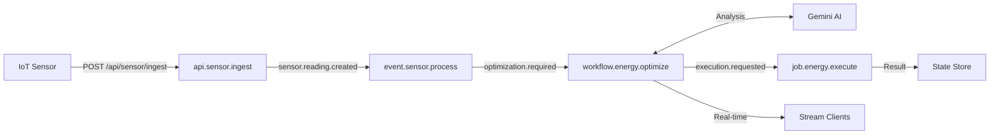
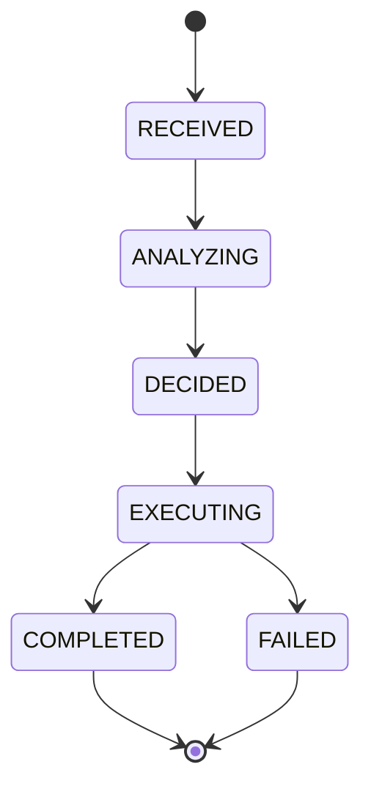

<div align="center">
  <h1>StateFlow Backend</h1>

  

  <br /><br />

  <strong>Event-driven energy optimization backend powered by AI decision-making.</strong>


## Overview

StateFlow is a production-ready backend system that monitors energy consumption from IoT sensors, detects threshold breaches, and automatically optimizes usage using Gemini AI. Built on the Motia framework, it demonstrates event-driven architecture with full observability.

| Metric | Value |
|--------|-------|
| Total Steps | 6 |
| Test Coverage | 75 tests |
| AI Integration | Google Gemini Flash |
| State Transitions | 6 states |
| Event Topics | 3 |

## Architecture

### System Flow



### State Machine



### Component Details

| Component | Type | Trigger | Emits | Description |
|-----------|------|---------|-------|-------------|
| `api.sensor.ingest` | API | HTTP POST | `sensor.reading.created` | Validates and persists sensor readings |
| `api.user.preferences` | API | HTTP POST | None | Manages user threshold configuration |
| `event.sensor.process` | Event | `sensor.reading.created` | `optimization.required` | Aggregates daily usage, checks thresholds |
| `workflow.energy.optimize` | Event | `optimization.required` | `execution.requested` | AI analysis and state orchestration |
| `job.energy.execute` | Event | `execution.requested` | None | Background execution with retries |
| `stream.energy.status` | Stream | State changes | N/A | Real-time client updates |

### Event Topics

| Topic | Publisher | Subscriber | Payload |
|-------|-----------|------------|---------|
| `sensor.reading.created` | api.sensor.ingest | event.sensor.process | sensorId, value, unit, type, timestamp, date |
| `optimization.required` | event.sensor.process | workflow.energy.optimize | optimizationId, date, totalConsumption, threshold, excessAmount |
| `execution.requested` | workflow.energy.optimize | job.energy.execute | optimizationId, decision, triggeredAt, date |

## Technology Stack

| Category | Technology | Version | Purpose |
|----------|------------|---------|---------|
| Runtime | Node.js | 20.x | Server execution |
| Framework | Motia | 0.17.x | Event-driven backend |
| Language | TypeScript | 5.x | Type safety |
| AI | Google Gemini | Flash | Optimization decisions |
| Queue | BullMQ | 5.x | Background job processing |
| State | Redis | 7.x | Distributed state management |
| Validation | Zod | 4.x | Schema validation |
| Testing | Vitest | 4.x | Test runner |

### Comparison: Event-Driven vs REST-Only

| Aspect | Event-Driven (StateFlow) | REST-Only |
|--------|--------------------------|-----------|
| Async Processing | Native | Requires external queue |
| Retry Logic | Built-in (BullMQ) | Manual implementation |
| Observability | Full tracing | Request-level only |
| Scaling | Horizontal via events | Load balancer only |
| State Management | Centralized | Per-request |
| Real-time Updates | Native streaming | Polling required |

</div>

## Quick Start

### Prerequisites

| Requirement | Version | Check Command |
|-------------|---------|---------------|
| Node.js | 20+ | `node --version` |
| pnpm | 9+ | `pnpm --version` |
| Redis | 7+ | `redis-cli ping` |


### Installation

```bash
# 1. Clone repository
git clone https://github.com/AnkanMisra/StateFlow.git
cd stateflow-backend

# 2. Install dependencies
pnpm install

# 3. Configure environment
cp .env.example .env.local
# Edit .env.local and add GEMINI_API_KEY (optional)

# 4. Start Redis (if not running)
brew install redis
brew services start redis

# 5. Start development server
pnpm dev
```

### Verification

```bash
# Check server is running
curl http://localhost:3000/api/sensor/ingest \
  -X POST \
  -H "Content-Type: application/json" \
  -d '{"sensorId": "sensor-001", "value": 150, "unit": "kWh", "type": "energy"}'
```

Expected response:
```json
{
  "success": true,
  "message": "Sensor reading ingested successfully",
  "sensorId": "sensor-001",
  "eventEmitted": "sensor.reading.created"
}
```

<div align="center">

## API Reference

### POST /api/sensor/ingest

Ingest sensor reading and trigger processing pipeline.

| Parameter | Type | Required | Description |
|-----------|------|----------|-------------|
| sensorId | string | Yes | Unique sensor identifier |
| value | number | Yes | Reading value (must be >= 0) |
| unit | string | No | Unit of measurement (default: kWh) |
| type | string | No | Sensor type: energy, temperature, humidity |

**Response Codes:**

| Code | Description |
|------|-------------|
| 201 | Reading ingested successfully |
| 400 | Validation error (missing sensorId or invalid value) |

### POST /api/user/preferences

Configure user thresholds.

| Parameter | Type | Required | Description |
|-----------|------|----------|-------------|
| thresholds.dailyMax | number | Yes | Daily consumption limit (kWh) |
| thresholds.peakHourLimit | number | Yes | Peak hour limit (kWh) |
| costSensitivity | string | Yes | low, medium, high |
| automationLevel | string | Yes | manual, suggested, automatic |

## AI Decision Logic

### Gemini AI Mode

When `GEMINI_API_KEY` is configured, the system uses Google Gemini Flash for intelligent analysis with contextual reasoning.

### Fallback Mode

When API is unavailable, deterministic rules apply:

| Excess Percentage | Action | Target Window | Confidence |
|-------------------|--------|---------------|------------|
| > 20% | SHIFT_LOAD | 02:00-05:00 | 0.85 |
| 10-20% | REDUCE_CONSUMPTION | 18:00-22:00 | 0.78 |
| < 10% | OPTIMIZE_SCHEDULING | 12:00-16:00 | 0.72 |

## Commands

| Command | Description |
|---------|-------------|
| `pnpm dev` | Start development server with hot reload |
| `pnpm start` | Start production server |
| `pnpm test` | Run test suite (75 tests) |
| `pnpm typecheck` | TypeScript type verification |
| `pnpm generate-types` | Regenerate type definitions from Steps |
| `pnpm clean` | Remove build artifacts |

## Environment Variables

| Variable | Required | Default | Description |
|----------|----------|---------|-------------|
| `GEMINI_API_KEY` | No | None | Google Gemini API key for AI decisions |
| `PORT` | No | 3000 | Server port |

## Testing

### Test Suite

| Test File | Tests | Coverage |
|-----------|-------|----------|
| api-sensor-ingest.test.ts | 8 | API validation, state write, event emission |
| event-processing.test.ts | 16 | Aggregation, threshold detection, idempotency |
| workflow-lifecycle.test.ts | 17 | State transitions, AI integration, logging |
| gemini-analyzer.test.ts | 17 | AI response parsing, fallback logic |
| job-execution.test.ts | 6 | Background execution, retry handling |
| **Total** | **75** | **All passing** |

</div>

### Running Tests

```bash
# Run all tests
pnpm test

# Run specific test file
pnpm test api-sensor-ingest

# Run with verbose output
pnpm test --reporter=verbose
```

<div align="center">

## Performance

| Operation | Duration | Notes |
|-----------|----------|-------|
| API Ingestion | < 50ms | Includes state write and event emission |
| Event Processing | < 100ms | Aggregation and threshold check |
| AI Decision (Gemini) | 3-6s | Network latency to Gemini API |
| AI Decision (Fallback) | < 10ms | Deterministic calculation |
| Job Execution | ~100ms | Simulated; production varies by action |

## Observability

Access Motia Workbench at `http://localhost:3000`:

| Tab | Purpose |
|-----|---------|
| Tracing | End-to-end request flow visualization |
| States | Real-time state inspection |
| Logs | Structured logging with trace correlation |
| Queues | Background job monitoring |


</div>
